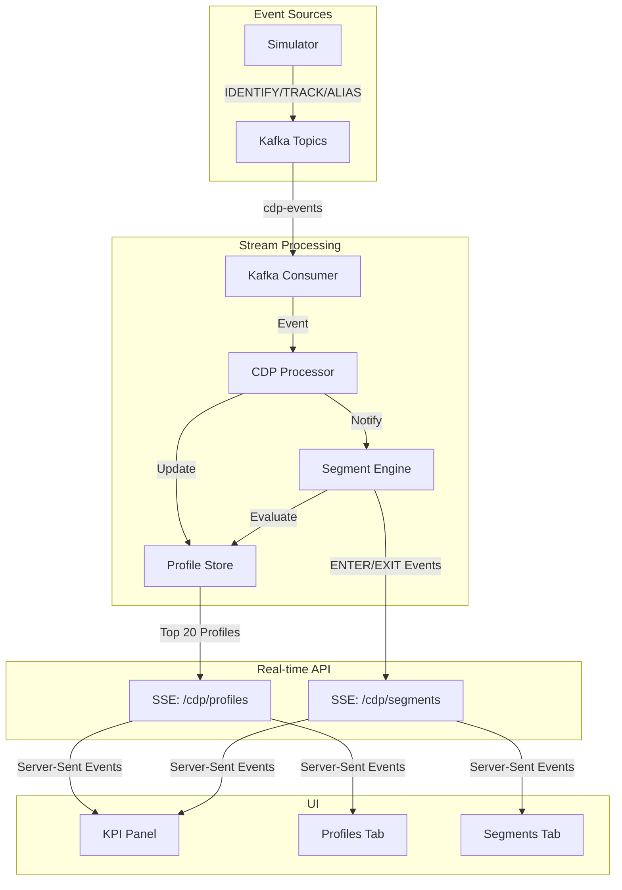

# CDP (Customer Data Platform) Module

## Overview

The CDP module is a real-time customer data platform that processes streaming events to build unified customer profiles and perform real-time segmentation. It demonstrates advanced stream processing concepts including event-time processing, windowing, late event handling, and conflict resolution.

## Architecture



## Core Concepts

### 1. Profile Unification

The CDP builds unified customer profiles by merging events from multiple sources:

- **IDENTIFY events**: Link identifiers (userId, email, anonymousId) to a profile
- **TRACK events**: Record behavioral events and update feature usage counters
- **ALIAS events**: Merge profiles when discovering that two identifiers belong to the same person

#### Profile Structure

```kotlin
data class CdpProfile(
    val profileId: String,              // Unique profile identifier
    val identifiers: ProfileIdentifiers, // All known identifiers
    val traits: Map<String, Any>,       // User attributes (plan, country, etc.)
    val lastSeen: Instant,              // Last activity timestamp
    val featureUsedCount: Int           // Rolling counter of feature usage
)

data class ProfileIdentifiers(
    val userIds: Set<String>,
    val emails: Set<String>,
    val anonymousIds: Set<String>
)
```

### 2. Event-Time Processing

The CDP uses **event time** (when the event actually occurred) rather than **processing time** (when the system processes it):

```kotlin
// Events carry their own timestamps
data class CdpEvent(
    val type: EventType,           // IDENTIFY, TRACK, ALIAS
    val timestamp: Instant,        // Event time (from client)
    val userId: String?,
    val anonymousId: String?,
    val email: String?,
    // ...
)
```

**Why Event Time?**
- Handles late-arriving events correctly
- Maintains accuracy across network delays
- Enables replay and backfill scenarios

### 3. Last-Write-Wins (LWW) Conflict Resolution

When multiple events update the same profile, the CDP uses **Last-Write-Wins** based on event timestamp:

```kotlin
fun updateProfile(event: CdpEvent) {
    val profile = getProfile(profileId)

    // Only update if event is newer than current profile state
    if (event.timestamp.isAfter(profile.lastSeen)) {
        profile.traits.putAll(event.traits)
        profile.lastSeen = event.timestamp
        // Update profile...
    }
}
```

**Benefits:**
- Deterministic conflict resolution
- Order-independent processing
- Handles out-of-order events gracefully

**Tradeoffs:**
- Assumes timestamps are reliable
- May discard valid concurrent updates
- No causal ordering guarantees

### 4. Dual Watermark Event Processing

The CDP uses a two-tier watermark system for handling events with different lateness characteristics:

```kotlin
class CdpEventProcessor(
    private val processingWindow: Duration = Duration.ofSeconds(5),
    private val lateEventGracePeriod: Duration = Duration.ofSeconds(120),
) {
    fun submit(event: CdpEvent, profileId: String) {
        val now = Instant.now()
        val lateEventCutoff = now.minus(lateEventGracePeriod)

        // Policy 1: Drop events beyond grace period
        if (event.ts.isBefore(lateEventCutoff)) {
            droppedEventsCounter.incrementAndGet()
            logger.warn("Event dropped (too late): lateness={}s",
                Duration.between(event.ts, now).seconds)
            return
        }

        // Policy 2: Accept late events with warning
        val processingCutoff = now.minus(processingWindow)
        if (event.ts.isBefore(processingCutoff)) {
            lateEventsCounter.incrementAndGet()
            logger.info("Late event accepted: lateness={}s",
                Duration.between(event.ts, now).seconds)
        }

        // Buffer event for processing
        eventQueues.computeIfAbsent(profileId) {
            PriorityQueue(compareBy { it.ts })
        }.offer(event)
    }
}
```

**Dual Watermark Policy:**

1. **Processing Window (5 seconds)**:
   - Events within 5s of current time: Buffered for micro-batching
   - Optimized for high-intensity workloads (10k+ events/sec)
   - Watermark advances every second

2. **Late Event Grace Period (120 seconds)**:
   - Events between 5s-120s old: Accepted as "late events"
   - Logged with INFO level for monitoring
   - Still processed correctly but tracked separately

3. **Event Rejection**:
   - Events older than 120s: Dropped entirely
   - Logged with WARN level
   - Tracked in `droppedEventsCounter` metric

**Benefits:**
- Fast processing (5s batching) for normal events
- Handles reasonable late arrivals (up to 2 minutes)
- Prevents unbounded buffering with hard cutoff
- Metrics distinguish between late and dropped events

### 5. Windowed Aggregations

The CDP uses sliding time windows for real-time metrics:

#### Feature Usage Counter (24-hour window)

```kotlin
class RollingEventCounter {
    private val window = Duration.ofHours(24)

    fun count(profileId: String, eventName: String): Int {
        val cutoff = Instant.now().minus(window)
        return events
            .filter { it.profileId == profileId }
            .filter { it.name == eventName }
            .filter { it.timestamp.isAfter(cutoff) }
            .count()
    }
}
```

**Window Characteristics:**
- **Type**: Sliding window
- **Size**: 24 hours
- **Slide**: Continuous (evaluated on each event)
- **Use case**: "Power User" segment (5+ feature uses in 24h)

#### UI Sparkline (2-minute window)

Client-side windowing for visualization:

```typescript
class SlidingWindow<T> {
  private windowMs: number = 2 * 60 * 1000; // 2 minutes

  evictOldEvents(): void {
    const now = Date.now();
    const cutoff = now - this.windowMs;
    this.events = this.events.filter(e => e.timestamp >= cutoff);
  }
}
```

**Window Characteristics:**
- **Type**: Sliding window
- **Size**: 2 minutes (120 seconds)
- **Update frequency**: 1 second
- **Use case**: Real-time sparkline visualization

### 6. Real-time Segmentation

The Segment Engine evaluates rules against profiles to trigger ENTER/EXIT events:

```kotlin
class SegmentEngine {
    private val segments = mapOf(
        "power_user" to ::isPowerUser,
        "pro_plan" to ::isProPlan,
        "reengage" to ::needsReengagement
    )

    fun evaluateSegments(profile: CdpProfile) {
        segments.forEach { (segmentName, rule) ->
            val currentlyInSegment = rule(profile)
            val wasInSegment = profile.segments.contains(segmentName)

            when {
                currentlyInSegment && !wasInSegment ->
                    emitSegmentEvent(profile, segmentName, ENTER)

                !currentlyInSegment && wasInSegment ->
                    emitSegmentEvent(profile, segmentName, EXIT)
            }
        }
    }
}
```

**Segment Rules:**

1. **power_user**: Users with 5+ "Feature Used" events in last 24 hours
2. **pro_plan**: Users with `traits.plan == "pro"`
3. **reengage**: Users inactive for 10+ minutes

### 7. Server-Sent Events (SSE)

The CDP streams data to the UI using SSE for low-latency updates:

#### Profile Stream (`/sse/cdp/profiles`)

```kotlin
@GetMapping("/sse/cdp/profiles", produces = [MediaType.TEXT_EVENT_STREAM_VALUE])
suspend fun streamProfiles(): Flow<ServerSentEvent<ProfileSummary>> = flow {
    while (currentCoroutineContext().isActive) {
        val profiles = profileStore.getTopProfiles(limit = 20)

        emit(ServerSentEvent.builder<ProfileSummary>()
            .event("profile_summaries")
            .data(profiles)
            .build())

        delay(2000) // Update every 2s
    }
}
```

**Characteristics:**
- Updates every 2 seconds
- Sends top 20 profiles sorted by lastSeen
- Lightweight summaries (not full profiles)

#### Segment Stream (`/sse/cdp/segments`)

```kotlin
@GetMapping("/sse/cdp/segments", produces = [MediaType.TEXT_EVENT_STREAM_VALUE])
fun streamSegmentEvents(): Flow<ServerSentEvent<SegmentEvent>> {
    return segmentEventFlow
        .map { event ->
            ServerSentEvent.builder<SegmentEvent>()
                .event("segment_event")
                .data(event)
                .build()
        }
}
```

**Characteristics:**
- Real-time push (no polling)
- ENTER/EXIT events as they occur
- High-frequency updates during active simulation

## Data Flow

### 1. Event Ingestion

```
Client Event → Kafka Topic → Consumer → CDP Processor
```

**Example: IDENTIFY Event**

```json
{
  "type": "IDENTIFY",
  "timestamp": "2025-10-05T20:15:30Z",
  "userId": "user-42",
  "anonymousId": "anon-123",
  "email": "user42@example.com",
  "traits": {
    "plan": "pro",
    "country": "US"
  }
}
```

### 2. Profile Update

```
CDP Processor → Profile Store → Segment Engine → SSE Stream
```

**Processing Steps:**

1. **Lookup/Create Profile**: Find existing profile or create new one
2. **Merge Identifiers**: Add new identifiers to profile
3. **Apply LWW**: Update traits only if event is newer
4. **Update Counters**: Increment feature usage (for TRACK events)
5. **Evaluate Segments**: Check if profile enters/exits any segments
6. **Broadcast Update**: Notify SSE subscribers

### 3. UI Updates

```
SSE Stream → React Hook → Component Re-render → User sees update
```

**Client-side Flow:**

```typescript
// 1. Hook subscribes to SSE
const { profiles } = useCdpProfiles(enabled);

// 2. Hook receives events and updates state
useEffect(() => {
  if (message.type === 'profile_summaries') {
    setProfiles(message.data);
  }
}, [lastMessage]);

// 3. Component re-renders with new data
<ProfilesList profiles={profiles} />
```

## Performance Optimizations

### Backend

1. **In-Memory Storage**: Profiles stored in `ConcurrentHashMap` for O(1) lookups
2. **Coroutines**: Non-blocking async processing with Kotlin coroutines
3. **Windowed Counters**: Efficient time-based aggregations with automatic cleanup
4. **SSE Throttling**: Profile stream updates every 2s to reduce bandwidth

### Frontend

1. **Throttled Rendering**: UI updates limited to 1s interval
2. **Sliding Windows**: Client-side windowing prevents unbounded memory growth
3. **Event Deduplication**: Tracks processed events to avoid duplicate work
4. **RequestAnimationFrame**: Smooth chart updates without reflow
5. **Memoization**: ProfileRow components memoized to prevent unnecessary re-renders

## Testing

### Unit Tests

**Backend:**
- Profile merging logic
- LWW conflict resolution
- Segment rule evaluation
- Rolling counter correctness

**Frontend:**
- Sliding window eviction (`slidingWindow.test.ts`)
- Unique counting logic
- Rate per minute calculations

### Integration Testing

```bash
# Start backend
./gradlew bootRun

# Start simulator (from UI)
# Navigate to CDP tab, click Start

# Verify:
# - Profiles appear in Live Profiles tab
# - Segment events appear in Segment Activity Feed
# - KPIs update in real-time
# - Sparkline shows activity
# - Stop button clears all data
```

## Monitoring & Observability

### Metrics

- `cdp.profiles.total`: Current number of profiles
- `cdp.events.buffered`: Events currently buffered (waiting for watermark)
- `cdp.events.processed`: Total events processed
- `cdp.events.late`: Late events accepted (beyond 5s, within 120s)
- `cdp.events.dropped`: Events dropped (beyond 120s grace period)
- `cdp.events.dedup_hits`: Duplicate events detected
- `cdp.watermark.lag_ms`: Current watermark lag (processing window)
- `cdp.segments.enter`: Segment ENTER events
- `cdp.segments.exit`: Segment EXIT events

### Logs

```
INFO  c.p.cdp.CdpProcessor - Processing IDENTIFY event: userId=user-42
DEBUG c.p.cdp.ProfileStore - Profile updated: profileId=prof-xyz, lastSeen=...
WARN  c.p.cdp.CdpProcessor - Late event discarded: age=PT15M, eventType=TRACK
INFO  c.p.cdp.SegmentEngine - Segment ENTER: profile=prof-xyz, segment=power_user
```

## Configuration

### Application Properties

```yaml
cdp:
  processing-window: 5s          # Micro-batching window for normal events
  late-event-grace: 120s         # Max lateness before event discard
  profile-stream-interval: 2s    # SSE profile update frequency
  power-user-threshold: 5        # Feature uses for power_user segment
  power-user-window: 24h         # Time window for power_user
  reengage-inactivity: 10m       # Inactivity threshold for reengage
```

## Future Enhancements

### Potential Improvements

1. **Persistent Storage**:
   - Add PostgreSQL/Redis for profile persistence
   - Implement event sourcing for full history

2. **Advanced Windowing**:
   - Session windows (activity-based grouping)
   - Tumbling windows (non-overlapping fixed windows)
   - Custom window functions

3. **Complex Segmentation**:
   - Boolean logic (AND/OR/NOT)
   - Nested conditions
   - Time-based rules (e.g., "abandoned cart in last 3 hours")

4. **Scalability**:
   - Partition profiles across multiple instances
   - Distributed caching (Redis)
   - Event replay from Kafka offsets

5. **Data Quality**:
   - Schema validation
   - Duplicate detection
   - Anomaly detection

## References

- [Event Time vs Processing Time](https://www.oreilly.com/radar/the-world-beyond-batch-streaming-101/)
- [Windowing in Stream Processing](https://flink.apache.org/news/2015/12/04/Introducing-windows.html)
- [Last-Write-Wins Conflict Resolution](https://martin.kleppmann.com/2014/03/31/distributed-data-management.html)
- [Server-Sent Events Specification](https://html.spec.whatwg.org/multipage/server-sent-events.html)

---

**Related Documentation:**
- [Main README](../../README.md)
- [TICKETS.md - EPIC L](../TICKETS.md)
- [Architecture Overview](../../README.md#architecture)
